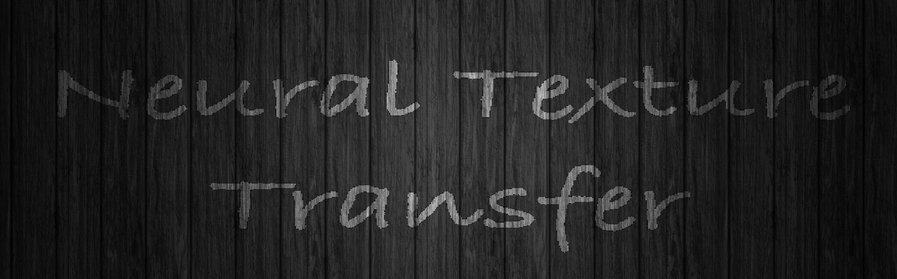
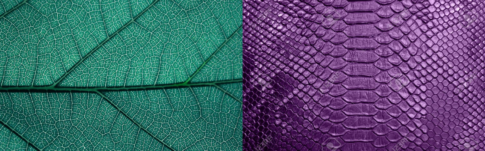
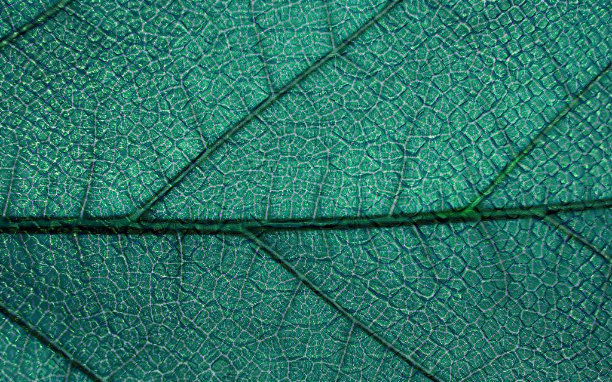

Neural texture transfer is a technique primarily designed to integrate the texture of one image into another. It is heavily inspired by the paper “A Neural Algorithm of Artistic Style” , which highlights an algorithm that demonstrates the power of backpropagation in optimization. Below is the corresponding computation graph

## Examples: content on the left and texture on the right

For more examples, click [me](https://github.com/jibynd/Neural-Texture-Transfer/tree/master/Examples)

# For more details, go to the [medium link](https://medium.com/@jibynd/neural-texture-transfer-b4110f9e6b7b)
 
